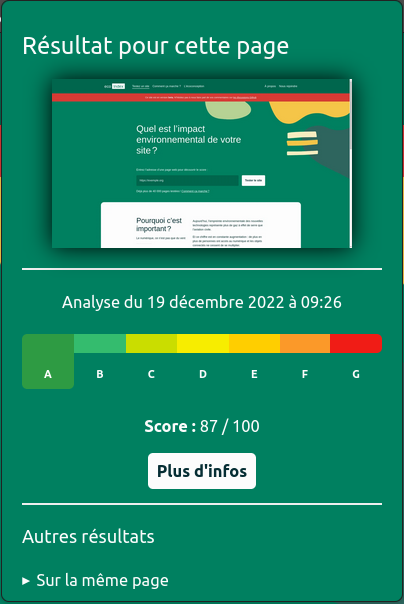
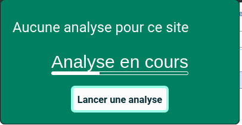
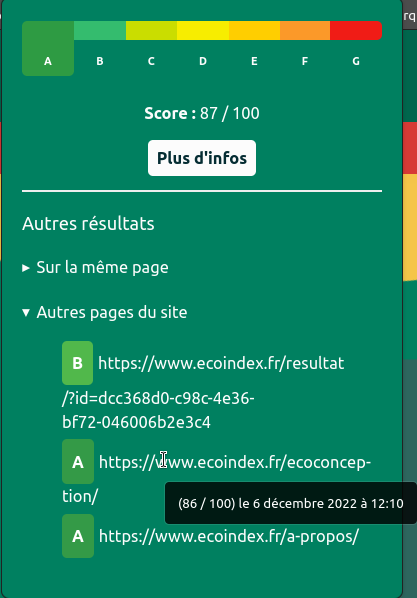

# Ecoindex chrome plugin

This is the source code of the Ecoindex browser plugin. 
This simple plugin allows you to check the Ecoindex of any website you visit.

## Description

You can easily check the Ecoindex of any website you visit:

When there is no result, you will see a message, and you will be proposed to run an analysis:

When the analysis is running, you will see a message:

You can also dislplay older results existing for this page, or other results for the same domain:

## [Code of conduct](CODE_OF_CONDUCT.md)

## [License](LICENSE.md)
